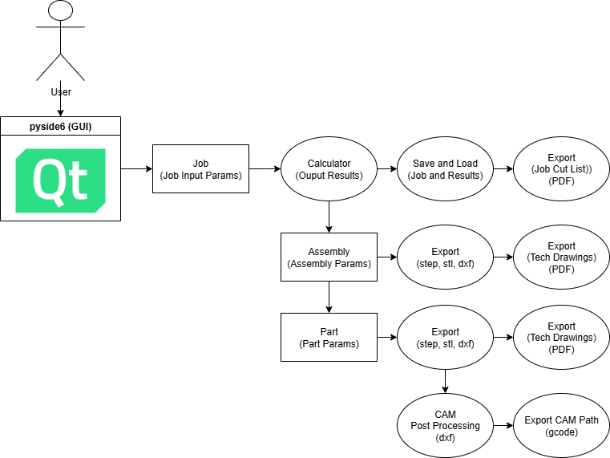

# Stairs App
**`Wooden Stairs Computer Aided Manufacturing App - QT Based Desktop App, Drawings (DXF/PDF), Cut Lists (PDF) , and CNC CAM (G-Code) 🚀`**

<!-- •[Link](#)

<hr>

## 🎬 Demo

[](https://www.youtube.com/watch?v=video_id)


-->


# 📦 Release
- [v0.2.0](https://github.com/HuzaifaIrfan-CADCAM/stairs_app/releases)


<hr>

## Demo Video

[](https://www.youtube.com/watch?v=phJr-eCjHw4)





# 🛠️ Development

## Target
- Linux/Windows Desktop (x86_64)

## Development Environment
- **OS**: Ubuntu 24.04 (x86_64)
- **IDE**: Visual Studio Code
- **Framework**: pyside6

## Conda Installation

- Install Miniforge and Add to Path
- https://conda-forge.org/download/


## Conda Environment Setup

```sh
mamba create --name stairs_app_env --file environment.yml
```

[New ENV Setup](env.md)

```sh
conda activate stairs_app_env
```


## Build

```sh
pyinstaller windows-app.spec
```

## Sign the EXE

```sh
signtool sign /a /fd SHA256 /td SHA256 /tr http://timestamp.digicert.com stairs_app.exe
```


# 🚀 Usage

## Run

```sh
python main.py
```


# 📝 Documentation

# 📚 References
- 

# 🤝🏻 Connect with Me

[](https://github.com/HuzaifaIrfan/)
[](https://www.huzaifairfan.com)
[](mailto:hi@huzaifairfan.com)

# 📜 License

Licensed under the GPL3 License, Copyright 2025 Huzaifa Irfan. [LICENSE](LICENSE)
